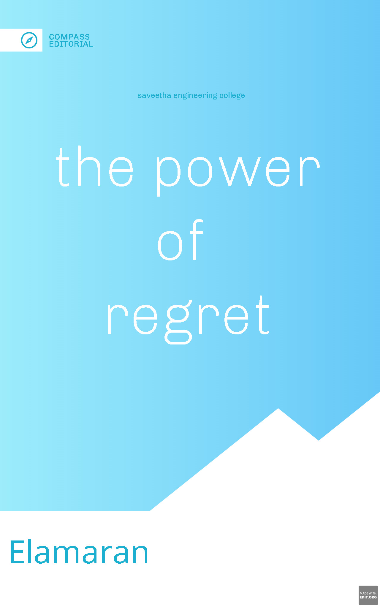

# cover-page-design
## AIM:
To develop a website to display the cover page design of a book

## Design Steps:

### Step 1:
Create a new Django project and app.

### Step 2:
Create a static file directory and mention the changes in settings.

### Step 3:
Make a new folder templates inside your app and create a html and map them using views and url.

### Step 4:
Write down the code for book cover using HTML and CSS.

### Step 5:
Add images and other contents using CSS record a screenshot of it.

### Step 6:
Publish the website in the given URL.

### Step 7:
Validate the HTML and CSS code.

## Code:
```
<!DOCTYPE html>
<html lang="en">
    <head>
        <meta name="viewport" content="width=device-width, initial-scale=1.0">
        <title>
            Book Cover Page
        </title>
        <style type="text/css"> 
        
        .bookpage {
            width: 700px;
            height: 900px;
            background-color: rgb(48,48,48);
            margin-left: auto;
            margin-right: auto;
        }
        p {
            color:white;
            font-family: Arial, Helvetica, sans-serif;
            text-align: left;
            font-size:79px;
            margin-top:15px;
            font-weight:bolder;
            margin-left: 40px;
            margin-bottom: 0;
        }
        .pp{
            color:white;
            font-family: Arial, Helvetica, sans-serif;
            text-align: left;
            font-size:25px;
            font-weight:bold;
            margin-top:20px;
            padding-right:90px;
            padding-left:45px;
        }
        .toptitle {
            color: white;
            font-size:15px;
            display:inline;
            position:relative;
            left:35px;
            top:25px;
            font-family: Arial, Helvetica, sans-serif;
        }
        .tophr {
            width: 200px;
            margin-top:29px;
        }
        .third{
            color:orangered;
            font-family: Arial, Helvetica, sans-serif;
            font-weight:bold;
            font-size:30px;
            display:inline;
            position:relative;
            left:38px;
            bottom:130px;
        }
        .image{
            margin-bottom: 0px;
        }
        .image2{
            display:inline;
            position:relative;
            left:250px;
            bottom:110px;
        }
            
        .lowhr {
            display:inline;
            position:relative;
            bottom:125px;
        }
        .name{
            color:white;
            font-family:Arial, Helvetica, sans-serif;
            display:inline;
            position:relative;
            left:50px;
            bottom:110px;
            font-size:40px;
            font-weight:bold;
        }
        .publisher{
            color:white;
            font-family:Arial, Helvetica, sans-serif;
            display:inline;
            position:relative;
            left:370px;
            bottom:110px;
            font-size:50px;
            font-weight:bold;
        }
        </style>
    </head>
    <body>
        <div class="bookpage">
            <div class="toptitle">
                EXPERT INSIGHT
            </div>
            <div class="tophr">
                <hr color="orangered">
            </div>
        <p>
            Responsive Web Design with 
            HTML5 and CSS
        <div class="pp">
        
                Develop future-proof responsive websites
                using the latest HTML5 and CSS techniques
           </div>
        <div class="image">
            
        </div>
        <div class="third">
            Third Edition
        </div>
        <div class="image2">
            
        </div>
        <div class="lowhr">
             <hr color="orangered">
        </div>
        <div class="name">
            JEGAN
        </div>
        <u class="publisher">
            Packt>
        </u>
    </div>
    </body>
</html>
```
## Output:


## Result:
Thus a website to display the cover page design of a book was successfully created.

